# 文字の形態における意味情報圧縮率並びにトークン数の簡易調査レポート

## 始まり
表意形態や象形形態などの文字の、意味情報圧縮率（いかに少ない文字で意図を伝えられるか）と、トークン効率（LLMのトークナイザーの効率）の関係を可視化してみたい、というところから始まる。

---
## 実験前の仮説
- 漢字:意味情報圧縮率は高いがトークン効率は悪い可能性がある
- 英語:意味情報圧縮率は低いがトークン効率は良い可能性がある

---
## 内容
- 日本語の文章を基準に英語、簡体中国語、韓国語に翻訳
- 単純な文字数とOpenAI Platform Tokenizerによるトークン数を簡易的にまとめる
- 日本語文は筆者が手ずから入力したものであり品質自体は担保されるが、多言語化はLLMによる翻訳のため品質の担保はできない
- あくまで簡易的な差を楽しむものである

---
## 初期検証
OpenAI Platform Tokenizerによるトークン数を参考にした実験前仮説の検証
### 日本語
#### 文章1
- 文字数:355
- トークン数:252
- トークン数あたりの文字数目安(四捨五入/有効桁数4):1.409
- トークン消費(少ないほどLLMの効率UP/四捨五入/小数第2位まで):70.99[%]
```markdown
これは、文字の種類における、意味情報の圧縮効率を測るためのテスト用テキストです。
何を見るのかと言うと、文字数と、トークン数です。文字数はそのまま文字数をカウントし、トークン数は、OpenAIが出しているTokenizerを用いて測ります。
トークン数に関してはモデルによって差が出るかもしれませんが、とりあえずGPT5.xでのトークン数測定を一旦のデータとさせていただきます。
日本語に関してはテスト実行者が自ら文字を入力しているのですが、英語・中国語・韓国語に関してはAIによる翻訳です。翻訳は、楽天が出しているRakuten AI 3.0に任せます。
あくまで意味情報の圧縮率とトークン効率をなんとなく可視化するものなので、厳密さは求めないでください。
これで、テスト用文章の終わりとさせていただきます。
```
[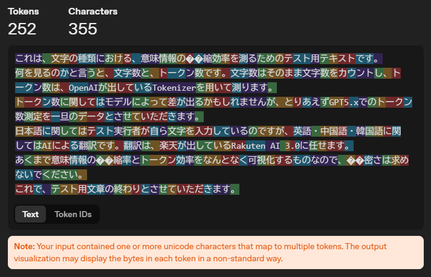](./日本語/日本語文章1.png)
#### 文章2
- 文字数:107
- トークン数94
- トークン数あたりの文字数目安(四捨五入/有効桁数4):1.138
- トークン消費(少ないほどLLMの効率UP/四捨五入/小数第2位まで):87.85[%]
```markdown
えーマジさ、バナナってちょー美味くね？ｗ
なんつーかさ、あのもさっとした独特の食感がたまんねえわけ
あと、何日か置いて黒くなってきたときの甘さときたら、もうたまらんわな！
牛乳と一緒にいただくと、最高に美味いんだ！
```
[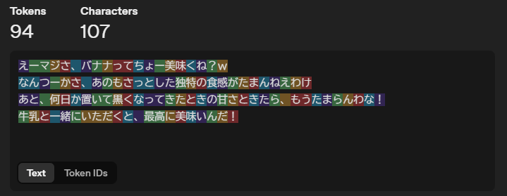](./日本語/日本語文章2.png)
#### 文章3
- 文字数:159
- トークン数:133
- トークン数あたりの文字数目安(四捨五入/有効桁数4):1.195
- トークン消費(少ないほどLLMの効率UP/四捨五入/小数第2位まで):83.65[%]
```markdown
我が邦における、東京湾上で発見された巨大不明生物、通称ゴジラについての処遇に関する閣議を始めます。
つきましては、ゴジラに対してどのようなアプローチを取るのか。
選択肢は、静観、駆除、捕獲のいずれかを選んで頂くようになります。
いかなる選択肢であろうとも、防衛省にて十分協議し、あらゆる作戦行動を実行可能といたします。
```
[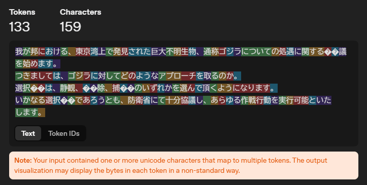](./日本語/日本語文章3.png)

---
### 簡体中国語
#### 文章1
- 文字数:267
- トークン数:163
- トークン数あたりの文字数目安(四捨五入/有効桁数4):1.638
- トークン消費(少ないほどLLMの効率UP/四捨五入/小数第2位まで):61.05[%]
```markdown
这是一段用于测量不同文字种类中语义信息压缩效率的测试文本。
我们关注的是字符数和 token 数。字符数按原样计数，token 数使用 OpenAI 提供的 Tokenizer 进行测量。
关于 token 数，可能会因模型不同而有所差异，但暂且以 GPT5.x 的 token 计数作为临时数据。
日语部分由测试执行者本人输入，而英语、中文、韩语部分为 AI 翻译。翻译由乐天推出的 Rakuten AI 3.0 完成。
这只是为了大致可视化语义信息的压缩率与 token 效率，请不要过分追求严格的严谨性。
至此，测试用文本结束。
```
[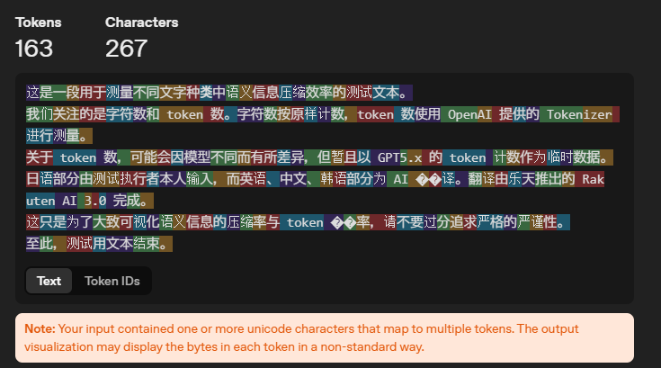](./中国語/中国語文章1.png)
#### 文章2
- 文字数:88
- トークン数:77
- トークン数あたりの文字数目安(四捨五入/有効桁数4):1.143
- トークン消費(少ないほどLLMの効率UP/四捨五入/小数第2位まで):87.50[%]
```markdown
诶，真心说，香蕉是不是超好吃啊？哈哈
怎么说呢，那种绵密又粉糯的独特口感，简直让人受不了
而且放上几天开始发黑的时候，那股甜味，简直没法挡！
配牛奶一起吃，真的绝了，太好吃了！
```
[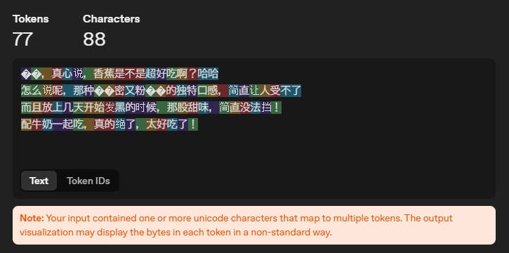](./中国語/中国語文章2.png)
#### 文章3
- 文字数:118
- トークン数:91
- トークン数あたりの文字数目安(四捨五入/有効桁数4):1.297
- トークン消費(少ないほどLLMの効率UP/四捨五入/小数第2位まで):77.12[%]
```markdown
现在开始就我国在东京湾发现的巨大不明生物（通称“哥斯拉”）的处置问题召开内阁会议。
接下来，请讨论针对哥斯拉应采取何种应对方式。
备选项为静观、清除、捕获，请从中作出选择。
无论作何选择，防卫省都将充分协商，并确保能够执行各项作战行动。
```
[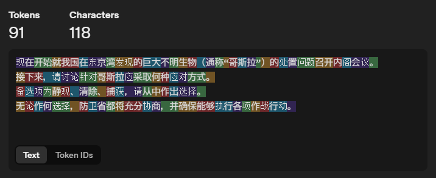](./中国語/中国語文章3.png)

---
### 英語
#### 文章1
- 文字数:789
- トークン数:152
- トークン数あたりの文字数目安(四捨五入/有効桁数4):5.191
- トークン消費(少ないほどLLMの効率UP/四捨五入/小数第2位まで):19.26[%]
```markdown
This is a test text for measuring the compression efficiency of semantic information across different writing systems.
What we will look at are the character count and the token count. The character count is simply the number of characters, and the token count is measured using the Tokenizer provided by OpenAI.
Token counts may vary depending on the model, but for now we will use measurements on GPT5.x as provisional data.
For Japanese, the test executor is entering the text manually, whereas the English, Chinese, and Korean versions are AI translations. The translations are handled by Rakuten AI 3.0 released by Rakuten.
This is only meant to roughly visualize the semantic compression ratio and token efficiency, so please do not demand strict rigor.
That concludes the test text.
```
[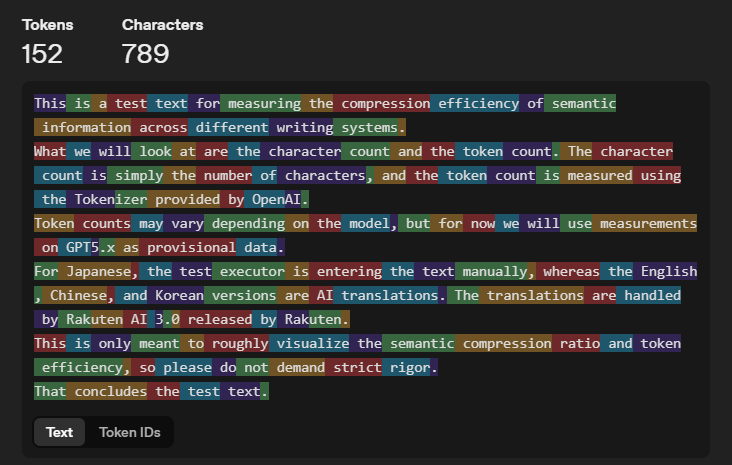](./英語/英語文章1.png)
#### 文章2
- 文字数308
- トークン数:65
- トークン数あたりの文字数目安(四捨五入/有効桁数4):4.738
- トークン消費(少ないほどLLMの効率UP/四捨五入/小数第2位まで):21.10[%]
```markdown
Like, seriously, bananas are sooo good, right? lol  
I mean, there’s just something irresistible about that soft, kinda dense texture.  
And when you leave them for a few days and they start getting brown, man, that sweetness is just unbeatable!  
Having them with milk makes them taste absolutely amazing!  
```
[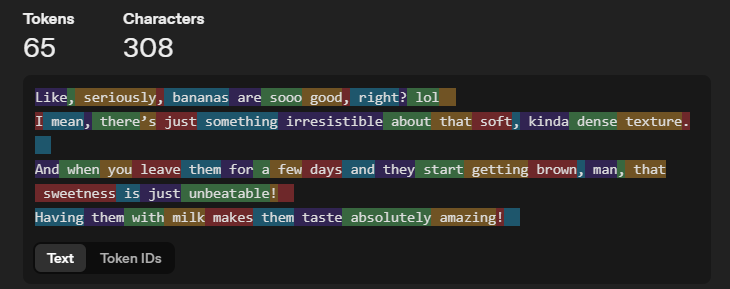](./英語/英語文章2.png)
#### 文章3
- 文字数:481
- トークン数:89
- トークン数あたりの文字数目安(四捨五入/有効桁数4):5.404
- トークン消費(少ないほどLLMの効率UP/四捨五入/小数第2位まで):18.50[%]
```markdown
We will now begin the cabinet meeting regarding how to address the giant unidentified creature discovered in Tokyo Bay in our country, commonly known as Godzilla.
Accordingly, we must determine what kind of approach should be taken toward Godzilla.
The available options are to observe the situation, exterminate it, or capture it.
Whichever option is chosen, the Ministry of Defense will conduct sufficient deliberations and ensure that all operational actions can be carried out.
```
[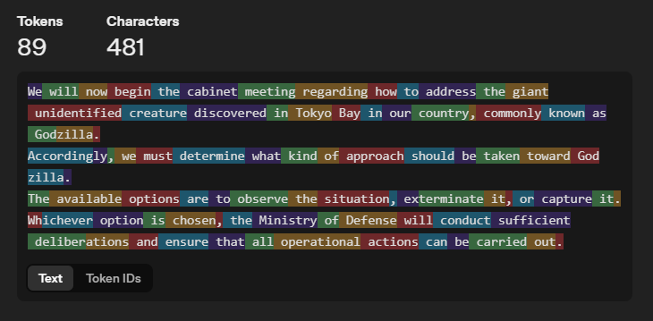](./英語/英語文章3.png)

---
### 韓国語
#### 文章1
- 文字数:353
- トークン数:190
- トークン数あたりの文字数目安(四捨五入/有効桁数4):1.858
- トークン消費(少ないほどLLMの効率UP/四捨五入/小数第2位まで):53.82[%]
```markdown
이는 문자 종류별로 의미 정보의 압축 효율을 측정하기 위한 테스트용 텍스트입니다.
우리가 볼 지표는 글자 수와 토큰 수입니다. 글자 수는 그대로 세고, 토큰 수는 OpenAI가 제공하는 Tokenizer로 측정합니다.
토큰 수는 모델에 따라 차이가 있을 수 있지만, 우선은 GPT5.x에서의 토큰 수 측정을 임시 데이터로 삼겠습니다.
일본어는 테스트 실행자가 직접 입력하며, 영어·중국어·한국어는 AI 번역본입니다. 번역은 라쿠텐이 출시한 Rakuten AI 3.0이 담당합니다.
이는 어디까지나 의미 정보의 압축률과 토큰 효율을 대략적으로 가시화하려는 것이므로, 엄밀함을 요구하지 말아 주세요.
이것으로 테스트용 문장을 마칩니다.
```
[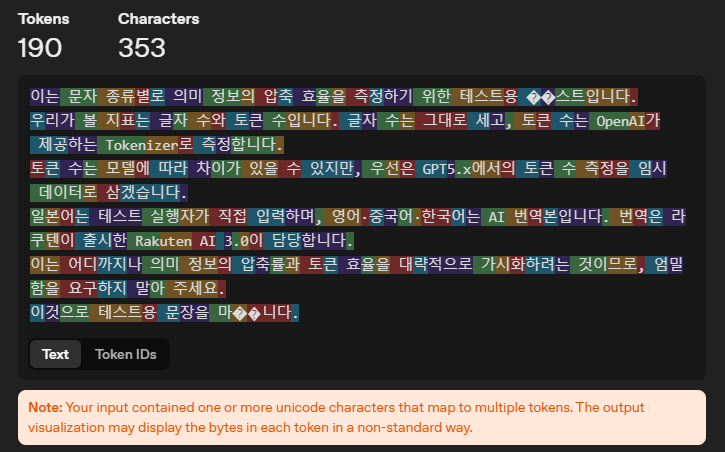](./韓国語/韓国語文章1.png)
#### 文章2
- 文字数:133
- トークン数:99
- トークン数あたりの文字数目安(四捨五入/有効桁数4):1.343
- トークン消費(少ないほどLLMの効率UP/四捨五入/小数第2位まで):74.44[%]
```markdown
아니 진짜, 바나나 완전 맛있지 않냐? ㅋㅋ  
뭐랄까, 그 살짝 퍽퍽하면서도 특유의 식감이 진짜 못 참겠어.  
그리고 며칠 놔뒀다가 까맣게 변해가기 시작할 때 그 달콤함은 진짜 끝내주지!  
우유랑 같이 먹으면 진짜 최고로 맛있어!  
```
[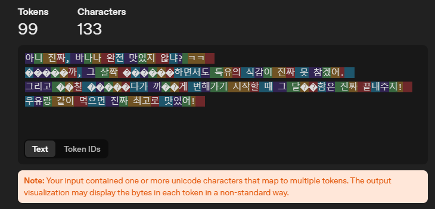](./韓国語/韓国語文章2.png)
#### 文章3
- 文字数:215
- トークン数:120
- トークン数あたりの文字数目安(四捨五入/有効桁数4):1.792
- トークン消費(少ないほどLLMの効率UP/四捨五入/小数第2位まで):55.81[%]
```markdown
우리나라 도쿄만에서 발견된 거대 정체불명 생물, 일명 고질라에 대한 대응 방안을 논의하는 각의(국무회의)를 지금부터 시작하겠습니다.
이에 따라 고질라에 대해 어떠한 접근 방식을 취할 것인지 결정해야 합니다.
선택지는 상황을 지켜보는 것, 구제하는 것, 포획하는 것 가운데 하나입니다.
어떠한 선택지를 택하더라도 방위성에서 충분히 협의하여 모든 작전 행동을 실행할 수 있도록 하겠습니다.
```
[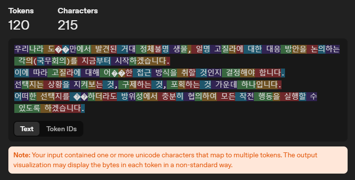](./韓国語/韓国語文章3.png)

---

## 追加検証.1
日本語の文章におけるOpenAIトークナイザーのボトルネック検証
### 日本語
#### 文章1(漢字なしバージョン)
- 文字数:423
- トークン数:315
- トークン数あたりの文字数目安(四捨五入/有効桁数4):1.343
- トークン消費(少ないほどLLMの効率UP/四捨五入/小数第2位まで):74.47[%]
```markdown
これは、もじのしゅるいにおける、いみじょうほうのあっしゅくこうりつをはかるためのテストようテキストです。
なにをみるのかというと、もじすうと、トークンすうです。もじすうはそのままもじすうをカウントし、トークンすうは、OpenAIがだしているTokenizerをもちいてはかります。
トークンすうにかんしてはモデルによってさがでるかもしれませんが、とりあえずGPT5.xでのトークンすうそくていをいったんのデータとさせていただきます。
にほんごにかんしてはテストじっこうしゃがみずからもじをにゅうりょくしているのですが、えいご・ちゅうごくご・かんこくごにかんしてはAIによるほんやくです。ほんやくは、らくてんがだしているRakuten AI 3.0にまかせます。
あくまでいみじょうほうのあっしゅくりつとトークンこうりつをなんとなくかしかするものなので、げんみつさはもとめないでください。
これで、テストようぶんしょうのおわりとさせていただきます。
```
[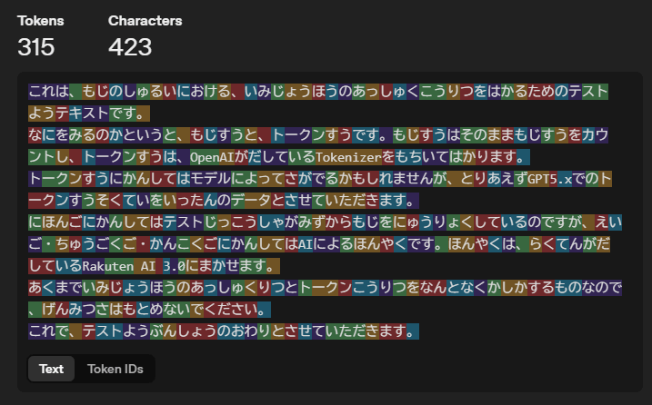](./日本語/日本語文章4.png)
#### 文章1(ローマ字入力)
- 文字数:713
- トークン数:279
- トークン数あたりの文字数目安(四捨五入/有効桁数4):2.556
- トークン消費(少ないほどLLMの効率UP/四捨五入/小数第2位まで):39.13[%]
```markdown
koreha,mojinosyuruiniokeru,imijouhounoassyukukourituwohakarutamenotesutoyoutekisutodesu.
naniwomirunokatoiuto,mojisuuto,to-kunsuudesu.mojisuuhasonomamamojisuuwokaunntosi,to-kunnsuuha,OpenAIgadasiteiruTokenizerwomotiitehakarimasu.
to-kunnsuunikannsitehamoderuniyottesagaderukamosiremasennga,toriaezuGPT5.xdenoto-kunnsuusokuteiwoittannnode-tatosaseteitadakimasu.
nihonngonikannsitehatesutojikkoshagamizukaramojiwonyuuryokusiteirunodesuga,eigo,tyuugokugo,kannkokugonikannsitehaAIniyoruhonnyakudesu.honnyakuha,rakutengadasiteiruRakuten AI 3.0nimakasemasu.
akumadeimijouhounoassyukuritutoto-kunnkourituwonanntonakukasikasurumononanode,gennmitusahamotomenaidekudasai.
korede,tesutoyoubunnshounoowaritosaseteitadakimasu.
```
[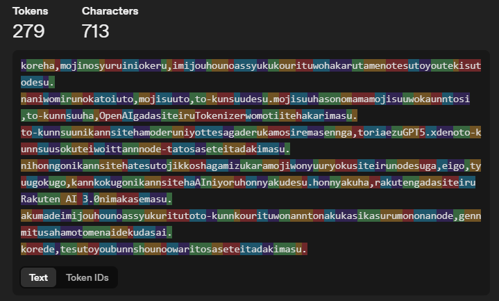](./日本語/日本語文章5.png)
#### 文章1(漢字増やしバージョン)
- 文字数:347
- トークン数:257
- トークン数あたりの文字数目安(四捨五入/有効桁数4):1.350
- トークン消費(少ないほどLLMの効率UP/四捨五入/小数第2位まで):74.06[%]
```markdown
之は、文字の種類に於ける、意味情報の圧縮効率を測る為のテスト用テキストです。
何を見るのかと言うと、文字数と、トークン数です。文字数は其の侭文字数をカウントし、トークン数は、OpenAIが出しているTokenizerを用いて測ります。
トークン数に関してはモデルによって差が出るかもしれませんが、とりあえずGPT5.xでのトークン数測定を一旦のデータとさせて頂きます。
日本語に関してはテスト実行者が自ら文字を入力しているのですが、英語・中国語・韓国語に関してはAIによる翻訳です。翻訳は、楽天が出しているRakuten AI 3.0に任せます。
飽く迄で意味情報の圧縮率とトークン効率をなんとなく可視化する物なので、厳密さは求めないでください。
これで、テスト用文章の終わりとさせて頂きます。
```
[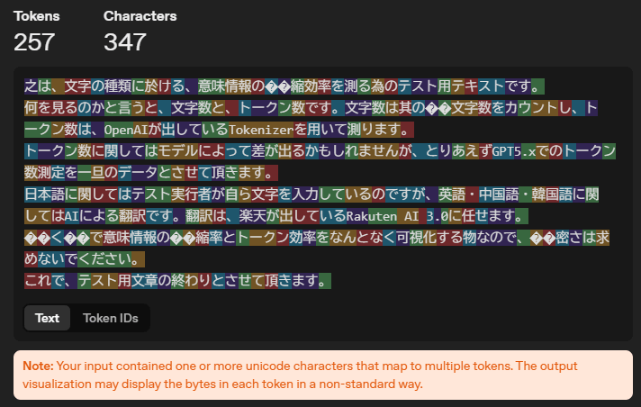](./日本語/日本語文章6.png)
#### 文章1(エセ中国語風味)
- 文字数:215
- トークン数:170
- トークン数あたりの文字数目安(四捨五入/有効桁数4):1.265
- トークン消費(少ないほどLLMの効率UP/四捨五入/小数第2位まで):79.07[%]
```markdown
此乃文字種類於意味情報圧縮効率測定之試験用文本。
所観者、文字数与令牌数。
文字数者即文字数計数、令牌数者以OpenAI公開Tokenizer測定。
令牌数関於模型差異或有出現、然姑且以GPT5.x於令牌数測定結果為暫定資料。
日本語関於試験実行者自入力、英語・中国語・韓国語関於AI翻訳。
翻訳委任於楽天所出Rakuten AI 3.0。
本文本飽迄為意味情報圧縮率与令牌効率之概略可視化用物、故勿求厳密。
以上、試験用文章終。
```
[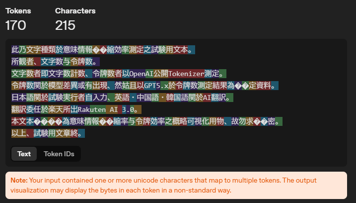](./日本語/日本語文章7.png)

---
## 現段階での結論
巷で言われるように、確かに日本語のトークン効率はよろしくはないらしい。
漢字そのものの意味情報圧縮率はやはり見立ての通り高いようで、このテストでも中国語を見る限りその結果は見て取れる。
英語は文字数自体は嵩む、つまり意味情報圧縮率は悪いと言える。しかし、GPT自体は英語圏生まれなのである意味で当然とも言えるが、LLMに対するトークン効率はやはりトップクラスで優秀であると言える。
考えてみれば日本語の文章は、`ひらがな`,`カタカナ`,`漢字`,`英語`と、4種類の文字を使っているわけで、トークナイザーでの効率が今一つになってしまうのも仕方がないのかもしれない。というか、英語圏の人が言う「習得が難しい言語」に日本語が入ってるわけで、このTokenizerは英語圏で学習しているわけだから日本語のトークン効率がよろしくないのもなかなか納得できてしまう。

> Category IV Languages: 88 weeks (2200 class hours)
>
> “Super-hard languages” – Languages which are exceptionally difficult for native English speakers.
> Arabic, Chinese – Cantonese, Chinese – Mandarin, Japanese, Korean
> 
> (日本語訳:カテゴリーIVの言語：88週間（2200授業時間）
> “超難関言語” — 英語のネイティブスピーカーにとって異例の難しさを誇る言語。アラビア語、中国語（広東語）、中国語（北京語）、日本語、韓国語)
>> (引用元：U.S. DEPARTMENT of STATE『Foreign Language Training』,2026年)

韓国語は面白いことにトークン効率では東アジア三国の言語(CJK)の中で優位に立つようだ。
再三言うがお気軽テストなので参考程度に。

---
## 追加検証.2を終えての結論
こちらを参考にどうぞ。長くなるので分けました。
[追加検証.2.md](追加検証.2.md)
[Abstracts.md](./参考文献/Abstracts.md)

[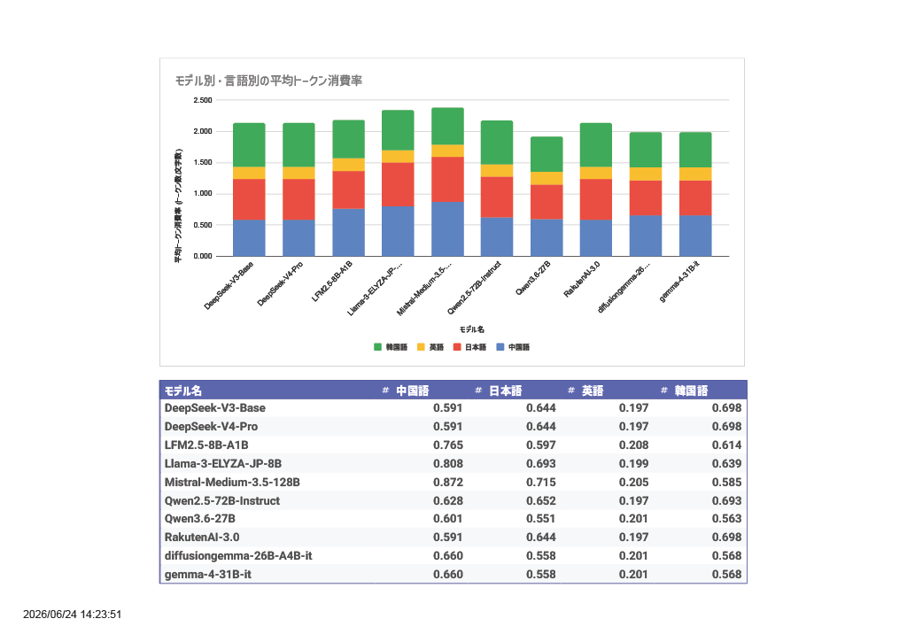](トークン効率グラフ.png)

英語が安定して効率よくトークンを扱えるらしい。少なくとも今のところは。どうしても、少しでもコンテキストウィンドウを効率よく使いたいなら英語を使う、という選択肢も出てくるだろう。最悪翻訳機を使いまくれば非英語話者でも行ける可能性があるが、そんなストレスを抱えるくらいなら最初から母語で対応することをおすすめする。

> In this work, we investigate incomplete tokens, i.e., undecodable tokens with stray bytes resulting from byte-level byte-pair encoding (BPE) tokenization. We hypothesize that such tokens are heavily reliant on their adjacent tokens and are fragile when paired with unfamiliar tokens. To demonstrate this vulnerability, we introduce improbable bigrams: out-of-distribution combinations of incomplete tokens designed to exploit their dependency. Our experiments show that improbable bigrams are significantly prone to hallucinatory behaviors. Surprisingly, the same phrases have drastically lower rates of hallucination (90% reduction in Llama3.1) when an alternative tokenization is used.

> (日本語訳:)本研究では、不完全なトークン、すなわちバイトレベルのバイトペアエンコーディング（BPE）によるトークン化の結果として生じる、余分なバイトを含むデコード不可能なトークンについて調査する。我々は、このようなトークンが隣接するトークンに大きく依存しており、見慣れないトークンと組み合わされた場合に脆弱になるという仮説を立てた。この脆弱性を実証するため、不完全なトークンの依存性を悪用するように設計された、分布外（out-of-distribution）の組み合わせである「不自然なバイグラム」を導入する。実験の結果、あり得ないビッグラムは幻覚的な挙動を著しく引き起こしやすいことが示された。驚くべきことに、別のトークン化手法を用いると、同じフレーズであっても幻覚の発生率が劇的に低下する（Llama3.1では90％の減少）ことが確認された。
>> (引用元：Eugene Jang, Kimin Lee, Jin-Woo Chung, Keuntae Park, Seungwon Shin『Improbable Bigrams Expose Vulnerabilities of Incomplete Tokens in Byte-Level Tokenizers』,2025年)

また、上記の結論はOpenAIのトークナイザーのみの結論であったが、いくつかの参考文献や`追加検証.2`を元に改めて結論をつけると、
1. そもそも3バイト文字がLLMに優しくない
2. しかも日本語は文字数が多い
3. 巷で日本語が自然と言われるような最新モデルは、他モデル比でトークン効率が良い
4. 意味理解自体はトークナイザーの効率よりも、シンプルに学習などで強化した方が効果が高い
5. トークン効率があまり良くないだけで、意味情報圧縮率そのものはそこまで悪くはないので、LLM相手でも意図を伝えやすい可能性はある

少なくとも2026年6月24日現在ではこう結論づけます。

---
## 参考サイト
- [OpenAI Platform Tokenizer](https://platform.openai.com/tokenizer)
- [U.S. DEPARTMENT of STATE『Foreign Language Training』](https://www.state.gov/national-foreign-affairs-training-center/foreign-language-training),2026年
- Andrew Gambardella, Takeshi Kojima, Yusuke Iwasawa, Yutaka Matsuo『Inconsistent Tokenizations Cause Language Models to be Perplexed by Japanese Grammar』,2025年
- Eugene Jang, Kimin Lee, Jin-Woo Chung, Keuntae Park, Seungwon Shin『Improbable Bigrams Expose Vulnerabilities of Incomplete Tokens in Byte-Level Tokenizers』,2025年
- Jean Seo, Jaeyoon Kim, SungJoo Byun, Hyopil Shin『How does a Language-Specific Tokenizer affect LLMs?』,2025年
- Simiao Ren, Xingyu Shen, Yuchen Zhou, Dennis (Tsang)Ng, Ankit Raj『Chinese Language Is Not More Efficient Than English in Vibe Coding: A Preliminary Study on Token Cost and Problem-Solving Rate』,2026年